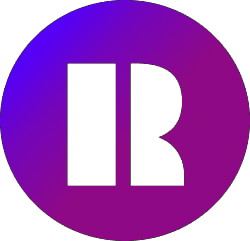
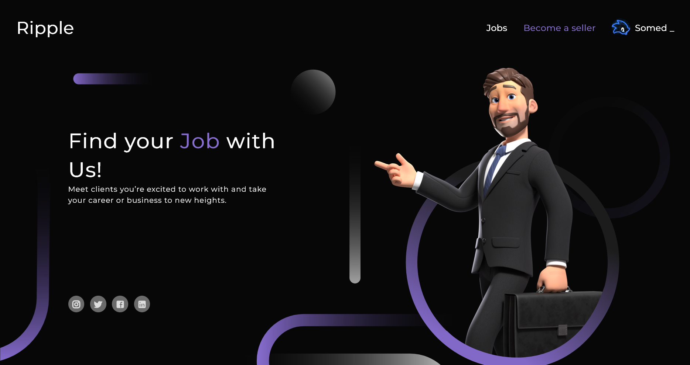

[![Last Commit][commit-shield]][commit-url]
[![Contributors][contributors-shield]][contributors-url]
[![Forks][forks-shield]][forks-url]
[![Stargazers][stars-shield]][stars-url]
[![Issues][issues-shield]][issues-url]
[![MIT License][license-shield]][license-url]

 

  

  <h3 align="center">Ripple</h3>

  

    <strong><em>Start ripple, transform your career</em></strong>
     
    <a href="https://github.com/othneildrew/Best-README-Template"><strong>Explore the docs »</strong></a>
     
     
    <a href="https://rippleone.tech/">View Demo</a>
    ·
    <a href="https://github.com/VoiceOfDarkness/Ripple/issues/new?labels=bug&template=bug-report---.md">Report Bug</a>
    ·
    <a href="https://github.com/VoiceOfDarkness/Ripple/issues/new?labels=enhancement&template=feature-request---.md">Request Feature</a>
  

<!-- TABLE OF CONTENTS -->

  
Table of Contents

  <ol>
    <li>
      <a href="#about-the-project">About The Project</a>
      <ul>
        <li><a href="#built-with">Built With</a></li>
      </ul>
    </li>
    <li><a href="#features">Features</a></li>
    <li><a href="#roadmap">Roadmap</a></li>
    <li><a href="#contact">Contact</a></li>
    <li><a href="#contributing">Contributing</a></li>
    <li><a href="#license">License</a></li>
  </ol>

<!-- ABOUT THE PROJECT -->
## About The Project

Welcome to Ripple, an innovative platform designed to bridge the gap between freelancers and clients seeking a variety of services. Ripple is built to create a vibrant marketplace where professionals can offer their expertise, and clients can find the perfect match for their needs. Inspired by the success of platforms like Fiverr, Ripple aims to provide a seamless and efficient experience for both service providers and seekers.

### Mission and Vision

Our mission is to empower freelancers to reach their full potential by providing them with a robust platform to showcase their skills and connect with clients globally. We envision a world where talented individuals can easily find work opportunities and build lasting professional relationships without the traditional barriers of location and networking.

(<a href="#readme-top">back to top</a>)

## Features
* **User Authentication:** Secure user authentication with Google.
* **Built-in Chat:** Real-time chat functionality for seamless communication between freelancers and clients.
* **Reviews:** Users can leave reviews for services they have used.
* **User Profiles:** Detailed profiles for freelancers and clients.
* **Service Listings:** Freelancers can list their services with detailed descriptions and pricing.

(<a href="#readme-top">back to top</a>)

## Built With
* [![FastAPI][FastAPI]][FastAPI-url]
* [![SQLModel][SQLModel]][SQLModel-url]
* [![SQLAlchemy][SQLAlchemy]][SQLAlchemy-url]
* [![PostgreSQL][PostgreSQL]][PostgreSQL-url]
* [![React][React.js]][React-url]
* [![Docker][Docker]][Docker-url]

(<a href="#readme-top">back to top</a>)

<!-- ROADMAP -->
## Roadmap

- [x] Add user auth via google account
- [x] Implement chat logic
- [ ] Implement payment logic
- [ ] Implement Help Center
- [ ] Multi-language Support
    - [ ] Azerbaijani
    - [ ] Spanish

See the [open issues](https://github.com/VoiceOfDarkness/Ripple/issues) for a full list of proposed features (and known issues).

(<a href="#readme-top">back to top</a>)

<!-- CONTRIBUTING -->
## Contributing

Contributions are what make the open source community such an amazing place to learn, inspire, and create. Any contributions you make are **greatly appreciated**.

If you have a suggestion that would make this better, please fork the repo and create a pull request. You can also simply open an issue with the tag "enhancement".
Don't forget to give the project a star! Thanks again!

1. Fork the Project
2. Create your Feature Branch (`git checkout -b <user_name>.feature/AmazingFeature`)
3. Commit your Changes (`git commit -m 'Add some AmazingFeature'`)
4. Push to the Branch (`git push origin <user_name>.feature/AmazingFeature`)
5. Open a Pull Request

(<a href="#readme-top">back to top</a>)

<!-- LICENSE -->
## License

Distributed under the MIT License. See `LICENSE.txt` for more information.

(<a href="#readme-top">back to top</a>)

[FastAPI]: https://img.shields.io/badge/FastAPI-005571?style=for-the-badge&logo=fastapi&logoColor=white
[FastAPI-url]: https://fastapi.tiangolo.com/
[SQLModel]: https://img.shields.io/badge/SQLModel-07405E?style=for-the-badge&logo=sqlmodel&logoColor=white
[SQLModel-url]: https://sqlmodel.tiangolo.com/
[SQLAlchemy]: https://img.shields.io/badge/SQLAlchemy-2C8EBB?style=for-the-badge&logo=sqlalchemy&logoColor=white
[SQLAlchemy-url]: https://www.sqlalchemy.org/
[PostgreSQL]: https://img.shields.io/badge/PostgreSQL-316192?style=for-the-badge&logo=postgresql&logoColor=white
[PostgreSQL-url]: https://www.postgresql.org/
[Docker]: https://img.shields.io/badge/Docker-2496ED?style=for-the-badge&logo=docker&logoColor=white
[Docker-url]: https://www.docker.com/

[commit-shield]: https://img.shields.io/github/last-commit/voiceofdarkness/Ripple.svg?style=for-the-badge
[commit-url]: https://github.com/voiceofdarkness/Ripple/commits/main

[contributors-shield]: https://img.shields.io/github/contributors/voiceofdarkness/Ripple.svg?style=for-the-badge
[contributors-url]: https://github.com/voiceofdarkness/Ripple/graphs/contributors
[forks-shield]: https://img.shields.io/github/forks/voiceofdarkness/Ripple.svg?style=for-the-badge
[forks-url]: https://github.com/voiceofdarkness/Ripple/network/members

[stars-shield]: https://img.shields.io/github/stars/voiceofdarkness/Ripple.svg?style=for-the-badge
[stars-url]: https://github.com/voiceofdarkness/Ripple/stargazers

[issues-shield]: https://img.shields.io/github/issues/voiceofdarkness/Ripple.svg?style=for-the-badge
[issues-url]: https://github.com/voiceofdarkness/Ripple/issues

[license-shield]: https://img.shields.io/github/license/voiceofdarkness/Ripple.svg?style=for-the-badge
[license-url]: https://github.com/voiceofdarkness/Ripple/blob/master/LICENSE.txt

[linkedin-shield]: https://img.shields.io/badge/-LinkedIn-black.svg?style=for-the-badge&logo=linkedin&colorB=555
[linkedin-url]: https://linkedin.com/in/othneildrew

[product-screenshot]: images/screenshot.png

[React.js]: https://img.shields.io/badge/React-20232A?style=for-the-badge&logo=react&logoColor=61DAFB
[React-url]: https://reactjs.org/
